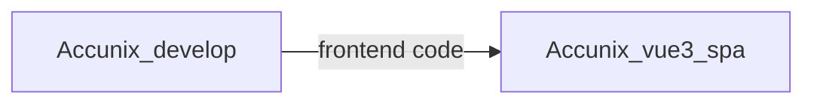
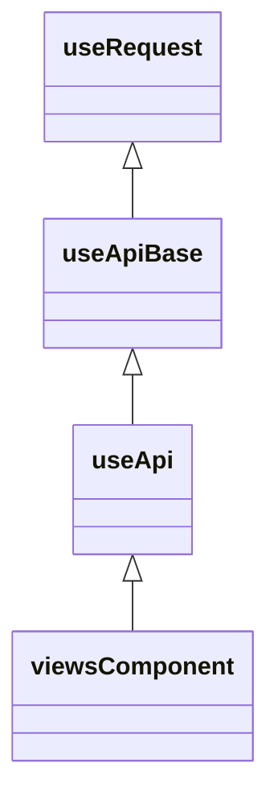
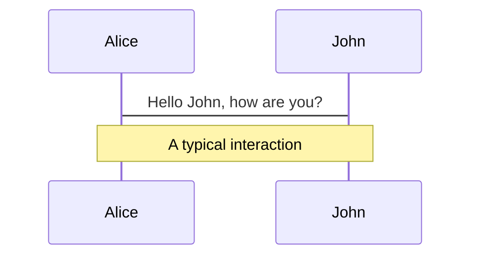
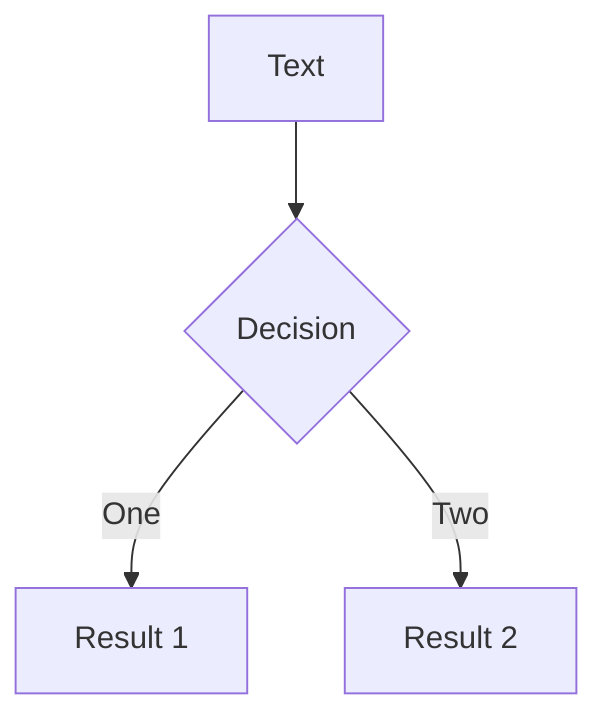
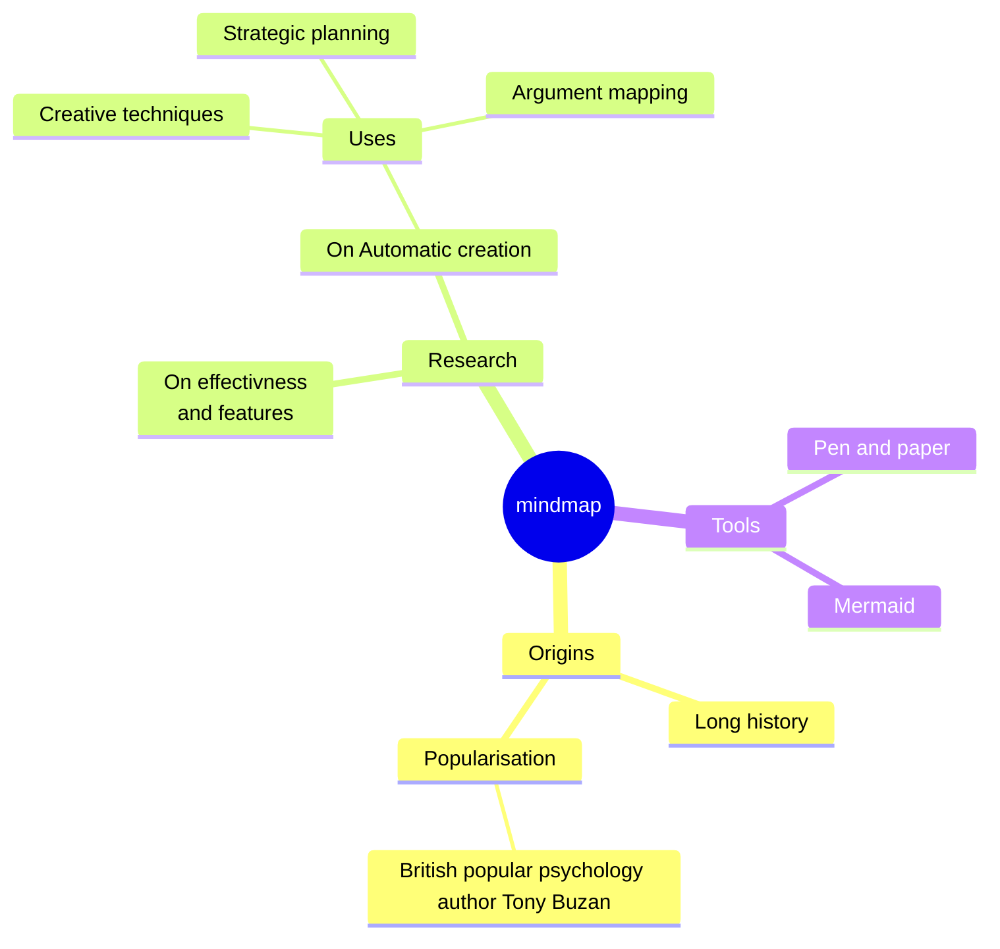
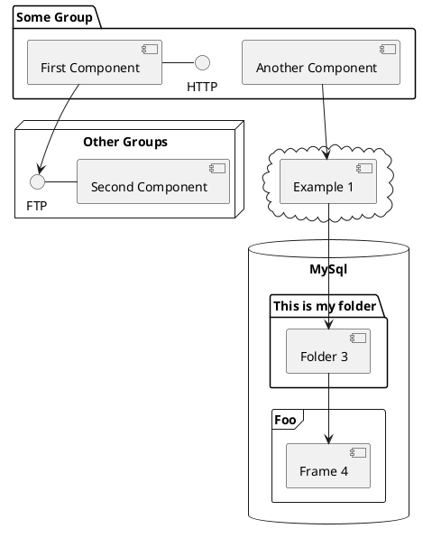

# AccuNix 前端開發探索：

## 挑戰、解決方案與優化策略

<div class="pt-12">
  <span @click="$slidev.nav.next" class="px-2 py-1 rounded cursor-pointer" hover="bg-white bg-opacity-10">
    Next <carbon:arrow-right class="inline"/>
  </span>
</div>

<div class="abs-br m-6 flex gap-2">
  <button @click="$slidev.nav.openInEditor()" title="Open in Editor" class="text-xl slidev-icon-btn opacity-50 !border-none !hover:text-white">
    <carbon:edit />
  </button>
  <a href="https://github.com/slidevjs/slidev" target="_blank" alt="GitHub" title="Open in GitHub"
    class="text-xl slidev-icon-btn opacity-50 !border-none !hover:text-white">
    <carbon-logo-github />
  </a>
</div>

<!--
The last comment block of each slide will be treated as slide notes. It will be visible and editable in Presenter Mode along with the slide. [Read more in the docs](https://sli.dev/guide/syntax.html#notes)
-->

---

<div flex>
  <div>
    <p align="center" >
      
    </p>
    <p flex>
      <span>
      <a href="https://github.com/vuejs/core">
          
        </a>
      </span>
      <span>
        <a href="https://github.com/element-plus/element-plus">
          
        </a>
      </span>
      <span>
        <a href="https://github.com/tailwindlabs/tailwindcss">
          
        </a>
      </span>
      <span>
      <a href="https://github.com/tailwindlabs/tailwindcss">
          
        </a>
      </span>
    </p>
  </div>
</div>
<div  grid grid-cols-2>
  <div>
    <h3>Accunix_vue3_spa</h3>
    <h2>專案建構套件</h2>
    <p>
    Vite+Vue3 + Typescript +Element Plus +
   Pinia + Tailwind css+Vitest</p>
    <h2>專案緣由</h2>
    <p>
    Accunix 目前系統由 Accunix_develop 與 Accunix_vue3_spa 兩專案組成，其中 Accunix_develop 用於管理 backend 以及 frontend 的 source code，Accunix_vue3_spa 用於管理 frontend 的 source code</p>
  </div>
  <div >
    </img>
  </div>

</div>

---

## 目前專案

1. Accunix_develop:
   php laravel + Vue2 (MPA)
   (Backend+Frontend)
2. Accunix_vue3_spa:
   Vue3 (SPA)
   (Frontend)



將逐漸將就有前端頁面由Accunix_develop 轉移至 Accunix_vue3_spa，新功能直接在Accunix_vue3_spa進行開發

## Accunix_develop 前端挑戰

1. 資料夾結構區分不明確
2. API呼叫與頁面強耦合：API散落在各個頁面，無法統一管理，且呼叫API邏輯與頁面強耦合
3. 組件狀態依賴，除錯不易，且狀態追蹤困難

---

## 目錄

- 📁**程式結構和管理**
- 📥 **API 與 ws 呼叫架構**
- 🧑‍💻 **組件狀態**
- ⚔️ **FP 與 高階函數**
- 🛠 **Service 化呼叫** -
- 🪬 **專案中的設計模式** -
- 🖥️ **專案程式碼品質** -

---

## </img>

1. Single Responsibility Principle
   > A class should have only one reason to change.
2. Open Close Principle
   > Software entities (classes, modules, functions, etc.) should be open for extension, but closed for modification.
3. Liskov Substitution Principle
4. Interface Segregation Principle
5. Dependency Inversion Principle

---

<div text-4xl m-auto h-full flex items-center>
<div>📁程式結構和管理</div>
</div>

---

📁**程式結構和管理**

🧨挑戰：資料夾結構區分不明確，造成維護與擴充不易

<div>
    </img>
</div>

- admin 代表 權限業務相關功能下的頁面組件
- common 代表 程式通用組件 還是常用功能業務相關功能的頁面組件?!
- header 代表 頁面組件 還是 頁面業務邏輯的頁面組件?!

---

📁**程式結構和管理**

## 一、 專案前端 資料夾結構

```markdown {all|2|8-11|16-18|all} twoslash
├── assets # 靜態檔案
├── components # component，與業務或資料層面無耦合之組件
├── hook # 共用hook
├── lib # lib
├── locales # i18用
├── providers # 依賴注入用
├── router # router
├── service # service
| ├──api # api 資料夾，每隻檔案對應一支api  
| ├──store # pinia store
| └──web-socket # webSocket 相關服務放置裡頭
|
├── style # css 用
├── router # router
├── type # router
├── views # 頁面views
| ├──comonents #根共用組件，與業務資料緊耦合之組件
| ├──....  
├.....
```

---

📁**程式結構和管理**

## 二、views 資料夾下配置

view 資料夾下配置

> 設計理念核心：看到url，就能找到檔案<br>
> 在views 底下 代表頁面資料夾以大寫開頭，其餘components 與 composable 皆以小寫開頭

### (一)範例1 登入頁需要修改

url

> https://accucms.accunix.net/login

目標資料夾

> views/Login/index.vue

共用組件 components
共用邏輯 composables

---

📁**程式結構和管理**

```markdown
├── views
| └──Login  
|------├──index.vue //(頁面)組件主要邏輯
|------├──components //(頁面)組件資料夾
|------------├──components //(組件)間共用組件資料夾
|------------└──composables //(組件)間共用邏輯資料夾
|------└──composables //(頁面)邏輯拆分資料夾
```

資料夾架構優勢

1. 維護容易:找尋目標頁面僅根據url 就能在對應資料夾下找到對應的組件
2. 組件與邏輯權限職責清晰:該資料夾下component 僅服務該層級中的所有組件,同理composables 僅服务該層級中的所有組件
3. 心智負擔低:Views層級底下資料夾邏輯一致，擴充或抽離邏輯組件容易 ，大寫開頭代表象徵頁面組件，小寫則為開發用組件

---

<div text-4xl m-auto h-full flex items-center>
<div>⚔️ FP 與 高階函數</div>
</div>

---

### ⚔️ **FP 與 高階函數**

## Functional Programming

是一種編程方式，將函數視為一等公民，主要特點如下

1. Pure Functions: 只要輸入相同參數， ALWAYS 輸出相同結果
2. Immutability: 不可變物件，避免變動資料，
3. Higher-Order-Function:函數可當作參數傳遞給其他函數，也能被返回為結果。'使函數更靈活的組合重用'
4. Recursion:使用遞歸作為主要流程結構，而非遞迴

---

### ⚔️ **FP 與 高階函數**

## 例子1 API Loading 動畫

因為不一定每隻 API 都需要Loading 動畫，且每一隻 API 所對應的 Loading 功能可能不同，所以我們需要使用高階函數來定義 Loading 功能，再由各個 API 的函數來定義 Loading 的動畫，而不是寫死在API中

```ts {all|1|2-4|5-20|all}
const isLoading = ref(false)
const { fetchCount, isFetchCountLoading } = useFetchCount()
const { fetchUsers, isFetchUserLoading } = useUsers()
const { fetchList, isFetchUserLoading } = useList()

const handleCountBtn = () => {
  isLoading.value = true
  await fetchCount()
  isLoading.value = false
}
const handleUsersBtn = () => {
  isLoading.value = true
  await fetchUsers()
  isLoading.value = false
}
const handleListBtn = () => {
  isLoading.value = true
  await fetchList()
  isLoading.value = false
}
```

---

### ⚔️ **FP 與 高階函數**

```ts {all|1|2-4|5-20|all}
const isLoading = ref(false)
const { fetchCount, isFetchCountLoading } = useFetchCount()
const { fetchUsers, isFetchUserLoading } = useUsers()
const { fetchList, isFetchUserLoading } = useList()
const loadingWith = promiseSurround(
  (isLoading.value = true),
  (isLoading = false)
)

const handleCountBtn = loadingWith(fetchCount)
const handleUsersBtn = loadingWith(fetchUsers)
const handleListBtn = loadingWith(fetchList)
```

---

PM大大👩:UsersBtn 和 handleListBtn 增加確定視窗

```vue {all|1-6|7-25}
<template>
  ...
  <btn @click="handleUsersBtn">Users</btn>
  <btn @click="handleListBtn">List</btn>
  <Confirm v-model="isShowConfirm" @confirm="handleConfirm" />
</template>
<script>
...
const isShowConfirm = ref(false)
const nowConfirmMode = ref<'users'|'list'>()
const handleUsersBtn = ()=>{
  isShowConfirm.value = true
  nowConfirmMode.value = 'users'
}
const handleListBtn = ()=> {
  isShowConfirm.value = true
  nowConfirmMode.value = 'list'
}
const handleConfirm=()=>{
  if(nowConfirmMode.value==='users'){
    loadingWith(fetchUsers)()
  }else{
    loadingWith(fetchList)()
  }
}
</script>
```

---

```vue {all|1-6|7-25}
<template>
  ...
  <btn @click="handleUsersBtn">Users</btn>
  <btn @click="handleListBtn">List</btn>
</template>
<script>
...
const confirm = useConfirm()
const handleUsersBtn = async()=>{
  const r = await useConfirm().then(()=>true).catch(()=>false)
  if(!r) return
  loadingWith(fetchUsers)()
}
const handleListBtn = async ()=> {
  const r = await useConfirm().then(()=>true).catch(()=>false)
  if(!r) return
  loadingWith(fetchList)()
}
</script>
```

Service 化

1. 減少外部依賴狀態 (isConfirmShow,nowConfirmMode)
2. 業務邏輯聚合在同一個函式當中，而非散落在template 與 好幾隻函數當中
3. 用一個函式來處理所有的事情，而非分開成好幾種函式

---

<div text-4xl m-auto h-full flex items-center>
<div>📥 API 與 WebSocket 呼叫架構</div>
</div>

---

📥 **API 與 ws 呼叫架構**

🧨挑戰：API呼叫與頁面強耦合

API呼叫散落在各個頁面，無法統一管理，且呼叫API邏輯與頁面強耦合

```js {all|4}
    //Views/Sms.vue
    storeOrUpdate() {
      let apiParams = { 'username': this.username, 'password': this.password }
      axiosConfig.post(`${this.apiPathBase}/smsStoreOrUpdate`, apiParams)
      .then((resp) => {
        //
        //
      }).catch((error) => {
        //...
      })
```

- 頁面組件要處理 api try catch
- 若api要進行檢查，就要寫在頁面組件
- 若api url 有進行修改，要到頁面組件去修改，
- 若同時以多個頁面用到，需要修改用到地方

違反 單一職責原則，頁面組件應當專注於該頁面的業務邏輯，API關注如何使用，不該知道API處理細節

---

📥 **API 與 ws 呼叫架構**

```markdown {all|2-4|5|6-10}
├── service # service
| ├──api # api 資料夾，每隻檔案對應一支api  
|-----├──index.ts
|-----└──descriptor.ts //api 驗證文件
| ├──store # pinia store
| └──web-socket # webSocket 相關服務放置裡頭
|-----├──index.ts
|-----└──descriptor.ts //api 驗證文件
```

---

📥 **API 呼叫架構**

<div grid grid-cols-2>
<div>



</div>
<div>
<h3>
1.useRequest
</h3>
<p>API呼叫方法，AXIOS 定義處</p>
<h3>
2.useApiBase
</h3>
<p>API抽象高階函數</p>
<h3>
3.useApi
</h3>
<p>API實作</p>
<h3>
4.ViewsComponent
</h3>
<p>呼叫處</p>
</div>

</div>

---

📥 **API 呼叫架構**

# useRequest 定義call API 的方法

置換方法處，可換成ajax 或 原生fetch

```ts {all|11}
export const useRequest = async <R extends {}, B extends {} = {}>({
  method,
  url,
  data,
  config,
}) => {
  const res = await Axios.request<R>({
    method,
    url,
    data,
    baseURL: import.meta.env.VITE_API_BASE_URL,
    validateStatus: function (status) {
      return (status >= 200 && status < 300) || status === 422
    },
    headers: {
      Authorization: `Bearer ${store.session.get('token')}`,
    },
    withCredentials: true,
    ...config,
  })
  if (res.status === 422) {
    return res.data
  }
}
```

---

📥 **API 呼叫架構**

# useApiBase API抽象高階函數

```ts {all|1|2|4-8|10-14}
export const useApiBase = <Req, Res>() => {
  //...實作內容，狀態變更與呼叫useRequest，並將try catch 限制在理頭處理
  return {
    //狀態
    isLoading,
    isError,
    isSuccess: computed(() => !isError.value),
    resData,
    //高階函數
    requestPostBase,
    requestGetBase,
    requestDeleteBase,
    requestPatchBase,
    requestPutBase,
  }
}
```

---

📥 **API 呼叫架構**

# useApiBase API抽象高階函數

```ts {all|2-5|10-19}
const requestBase = (
  type: Method,
  url: string,
  data?: Req,
  config?: Config
) => {
  /// 呼叫useRequest與狀態變更實作
}

const requestPostBase = (url: string, data?: Req, config?: Config) =>
  requestBase('POST', url, data, config)
const requestGetBase = (url: string, params?: Req, config?: Config) =>
  requestBase('GET', url, params, config)
const requestDeleteBase = (url: string, data?: Req, config?: Config) =>
  requestBase('DELETE', url, data, config)
const requestPatchBase = (url: string, data?: Req, config?: Config) =>
  requestBase('PATCH', url, data, config)
const requestPutBase = (url: string, data?: Req, config?: Config) =>
  requestBase('PUT', url, data, config)
```

---

📥 **API 架構**

# API實作

useAccount.ts

```ts {all|2-3|4-17|10-17}
export default () => {
  const { isLoading, isError, botStore, resData, requestGetBase, isSuccess } =
    useApiBase<AssignCountReq, AssignCountRes>()
  const fetchData = (chatroomStatus: ChatroomStatusEnum) => {
    const url = URL(botStore.botApiPath)
    return requestGetBase(
      url,
      {
        chatroomStatus,
      },
      {
        validate: {
          //API req res資料動態檢查
          reqDescriptor: descriptor.reqDescriptor(),
          resDescriptor: descriptor.resDescriptor(),
        },
      }
    )
  }
}
```

---

📥 **API呼叫架構**

PM大大👩

友善的 前端RD 🙉

🙉(開發功能中)

👩：出事了 系統壞掉了，怎麼資料沒有顯示出來

🙉：假的 怎麼可能 程式碼沒動吧 我去檢查一下console

//15分鐘後

🙉：這隻api好像少給一個欄位，另外一個欄位應該給布林怎麼變成數字了，應該是後端api有變更

🙉：PM ，後端好像資料有問題

👩：真的假的 那我去問問後端

🙉：我剛剛前端寫到一半，我在寫什麼

---

📥 **API呼叫架構**

有了動態資料驗證後
🙉(開發功能中)

👩：出事了 系統壞掉了，怎麼資料沒有顯示出來

🙉：假的 怎麼可能 程式碼沒動吧 我去檢查一下console

//2秒打開後
</img>

🙉：原來，這隻api好像少給一個欄位，另外一個欄位應該給布林怎麼變成數字了，應該是後端api有變更

🙉：PM ，後端好像資料有問題

👩：真的假的 那我去問問後端

🙉：ok

真棒 更快的<span line-through>甩鍋</span> 釐清問題

---

📥 **API呼叫架構**

async-validator
Element plus Form 預設驗證方式

```js
const descriptor = {
  name: {
    type: 'string',
    required: true,
    validator: (rule, value) => value === 'muji',
  },
  age: {
    type: 'number',
    asyncValidator: (rule, value) => {
      return new Promise((resolve, reject) => {
        if (value < 18) {
          reject('too young') // reject with error message
        } else {
          resolve()
        }
      })
    },
  },
}
```

驗證資料型別，資料格式，資料長度，資料是否為空，資料是否符合特定規則等等

---

📥 **API呼叫架構**

# API使用

Account/List.ts

```ts {all|1-3|5-12}
import useAssignCount from '@/service/api/botFeature/common/Chatroom/useAssignCount'
const { fetchData: fetchAssignCount, isError: isFetchAssignCountError } =
  useAssignCount()
//...

const handleFetchAssignCount = async () => {
  const res = await fetchAssignCount(props.chatroomStatus)
  if (isFetchAssignCountError.value) return
  total.value = res.total
  unAssign.value = res.unAssign
  assignSelf.value = res.assignSelf
  return total.value
}
```

---

```markdown
├── service # service
| ├──api # api 資料夾，每隻檔案對應一支api  
|-----├──index.ts //api 主文件
|-----├──type.ts //api 靜態驗證文件，放ts 定義文件
|-----└──descriptor.ts //api 動態驗證文件
```

API架構優勢

1. API 與 頁面解耦，頁面不需要執行try catch，不需要知道url 與 api使用方式等細節，只要關注於使用
2. API動態驗證 ，ts只有靜態驗證，加入動態驗證補足，快速找到問題
3. 驗證 動態驗證與靜態驗證皆在該資料夾中，維護容易

---

## transition: fade-out

# What is Slidev?

Slidev is a slides maker and presenter designed for developers, consist of the following features

- 📝 **Text-based** - focus on the content with Markdown, and then style them later
- 🎨 **Themable** - theme can be shared and used with npm packages
- 🧑‍💻 **Developer Friendly** - code highlighting, live coding with autocompletion
- 🤹 **Interactive** - embedding Vue components to enhance your expressions
- 🎥 **Recording** - built-in recording and camera view
- 📤 **Portable** - export into PDF, PNGs, or even a hostable SPA
- 🛠 **Hackable** - anything possible on a webpage

<br>
<br>

Read more about [Why Slidev?](https://sli.dev/guide/why)

<!--
You can have `style` tag in markdown to override the style for the current page.
Learn more: https://sli.dev/guide/syntax#embedded-styles
-->

<style>
h1 {
  background-color: #2B90B6;
  background-image: linear-gradient(45deg, #4EC5D4 10%, #146b8c 20%);
  background-size: 100%;
  -webkit-background-clip: text;
  -moz-background-clip: text;
  -webkit-text-fill-color: transparent;
  -moz-text-fill-color: transparent;
}
</style>

<!--
Here is another comment.
-->

---

## layout: default

# Table of contents

```html
<Toc minDepth="1" maxDepth="1"></Toc>
```

<Toc maxDepth="1"></Toc>

---

transition: slide-up
level: 2

---

# Navigation

Hover on the bottom-left corner to see the navigation's controls panel, [learn more](https://sli.dev/guide/navigation.html)

## Keyboard Shortcuts

|                                                    |                             |
| -------------------------------------------------- | --------------------------- |
| <kbd>right</kbd> / <kbd>space</kbd>                | next animation or slide     |
| <kbd>left</kbd> / <kbd>shift</kbd><kbd>space</kbd> | previous animation or slide |
| <kbd>up</kbd>                                      | previous slide              |
| <kbd>down</kbd>                                    | next slide                  |

<!-- https://sli.dev/guide/animations.html#click-animations -->


<p v-after class="absolute bottom-23 left-45 opacity-30 transform -rotate-10">Here!</p>

---

layout: image-right
image: https://source.unsplash.com/collection/94734566/1920x1080

---

# Code

Use code snippets and get the highlighting directly, and even types hover![^1]

```ts {all|5|1-6|9|all} twoslash
// TwoSlash enables TypeScript hover information and errors in markdown code blocks
// Learn more at https://www.typescriptlang.org/dev/twoslash/
function getUser(id: number): User {
  return undefined as any
}
function saveUser(id: number, user: User) {
  // ...
}
// ---cut---
interface User {
  id: number
  firstName: string
  lastName: string
  role: string
  // ^?
}

function updateUser(id: number, update: User) {
  const user = getUser(id)
  const newUser = { ...user, ...update }
  saveUser(id, newUser)
}
```

<arrow v-click="[3, 4]" x1="400" y1="420" x2="230" y2="330" color="#564" width="3" arrowSize="1" />

[^1]: [Learn More](https://sli.dev/guide/syntax.html#line-highlighting)

<style>
.footnotes-sep {
  @apply mt-20 opacity-10;
}
.footnotes {
  @apply text-sm opacity-75;
}
.footnote-backref {
  display: none;
}
</style>

---

# Components

<div grid="~ cols-2 gap-4">
<div>

You can use Vue components directly inside your slides.

We have provided a few built-in components like `<Tweet/>` and `<Youtube/>` that you can use directly. And adding your custom components is also super easy.

```html
<Counter :count="10" />
```

<!-- ./components/Counter.vue -->
<Counter :count="10" m="t-4" />

Check out [the guides](https://sli.dev/builtin/components.html) for more.

</div>
<div>

```html
<Tweet id="1390115482657726468" />
```

<Tweet id="1390115482657726468" scale="0.65" />

</div>
</div>

<!--
Presenter note with **bold**, *italic*, and ~~striked~~ text.

Also, HTML elements are valid:
<div class="flex w-full">
  <span style="flex-grow: 1;">Left content</span>
  <span>Right content</span>
</div>
-->

---

## class: px-20

# Themes

Slidev comes with powerful theming support. Themes can provide styles, layouts, components, or even configurations for tools. Switching between themes by just **one edit** in your frontmatter:

<div grid="~ cols-2 gap-2" m="t-2">

```yaml
---
theme: default
---
```

```yaml
---
theme: seriph
---
```


</div>

Read more about [How to use a theme](https://sli.dev/themes/use.html) and
check out the [Awesome Themes Gallery](https://sli.dev/themes/gallery.html).

---

## preload: false

# Animations

Animations are powered by [@vueuse/motion](https://motion.vueuse.org/).

```html
<div v-motion :initial="{ x: -80 }" :enter="{ x: 0 }">Slidev</div>
```

<div class="w-60 relative mt-6">
  <div class="relative w-40 h-40">
    
    
    
  </div>

  <div
    class="text-5xl absolute top-14 left-40 text-[#2B90B6] -z-1"
    v-motion
    :initial="{ x: -80, opacity: 0}"
    :enter="{ x: 0, opacity: 1, transition: { delay: 2000, duration: 1000 } }">
    Slidev
  </div>
</div>

<!-- vue script setup scripts can be directly used in markdown, and will only affects current page -->
<script setup lang="ts">
const final = {
  x: 0,
  y: 0,
  rotate: 0,
  scale: 1,
  transition: {
    type: 'spring',
    damping: 10,
    stiffness: 20,
    mass: 2
  }
}
</script>

<div
  v-motion
  :initial="{ x:35, y: 40, opacity: 0}"
  :enter="{ y: 0, opacity: 1, transition: { delay: 3500 } }">

[Learn More](https://sli.dev/guide/animations.html#motion)

</div>

---

# LaTeX

LaTeX is supported out-of-box powered by [KaTeX](https://katex.org/).

<br>

Inline $\sqrt{3x-1}+(1+x)^2$

Block

$$
{1|3|all}
\begin{array}{c}

\nabla \times \vec{\mathbf{B}} -\, \frac1c\, \frac{\partial\vec{\mathbf{E}}}{\partial t} &
= \frac{4\pi}{c}\vec{\mathbf{j}}    \nabla \cdot \vec{\mathbf{E}} & = 4 \pi \rho \\

\nabla \times \vec{\mathbf{E}}\, +\, \frac1c\, \frac{\partial\vec{\mathbf{B}}}{\partial t} & = \vec{\mathbf{0}} \\

\nabla \cdot \vec{\mathbf{B}} & = 0

\end{array}
$$

<br>

[Learn more](https://sli.dev/guide/syntax#latex)

---

# Diagrams

You can create diagrams / graphs from textual descriptions, directly in your Markdown.

<div class="grid grid-cols-4 gap-5 pt-4 -mb-6">









</div>

[Learn More](https://sli.dev/guide/syntax.html#diagrams)

---

src: ./pages/multiple-entries.md
hide: false

---

---

layout: center
class: text-center

---

# Learn More

[Documentations](https://sli.dev) · [GitHub](https://github.com/slidevjs/slidev) · [Showcases](https://sli.dev/showcases.html)
