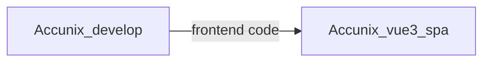
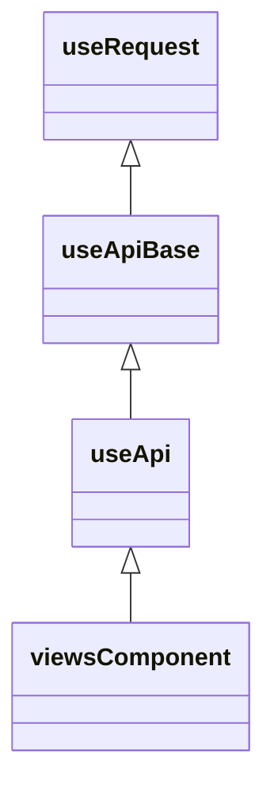
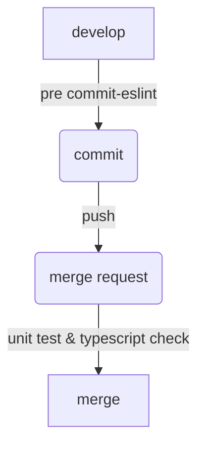

# AccuNix 前端開發探索：

## 挑戰、解決方案與優化策略

<div class="pt-12">
  <span @click="$slidev.nav.next" class="px-2 py-1 rounded cursor-pointer" hover="bg-white bg-opacity-10">
    Next <carbon:arrow-right class="inline"/>
  </span>
</div>

<div class="abs-br m-6 flex gap-2">
  <button @click="$slidev.nav.openInEditor()" title="Open in Editor" class="text-xl slidev-icon-btn opacity-50 !border-none !hover:text-white">
    <carbon:edit />
  </button>
  <a href="https://github.com/slidevjs/slidev" target="_blank" alt="GitHub" title="Open in GitHub"
    class="text-xl slidev-icon-btn opacity-50 !border-none !hover:text-white">
    <carbon-logo-github />
  </a>
</div>

<!--
The last comment block of each slide will be treated as slide notes. It will be visible and editable in Presenter Mode along with the slide. [Read more in the docs](https://sli.dev/guide/syntax.html#notes)
-->

---

<div flex>
  <div>
    <p align="center" >
      
    </p>
    <p flex>
      <span>
      <a href="https://github.com/vuejs/core">
          
        </a>
      </span>
      <span>
        <a href="https://github.com/element-plus/element-plus">
          
        </a>
      </span>
      <span>
        <a href="https://github.com/tailwindlabs/tailwindcss">
          
        </a>
      </span>
      <span>
      <a href="https://github.com/tailwindlabs/tailwindcss">
          
        </a>
      </span>
    </p>
  </div>
</div>
<div  grid grid-cols-2>
  <div>
    <h3>Accunix_vue3_spa</h3>
    <h2>專案建構套件</h2>
    <p>
    Vite+Vue3 + Typescript +Element Plus +
   Pinia + Tailwind css+Vitest</p>
    <h2>專案緣由</h2>
    <p>
    Accunix 目前系統由 Accunix_develop 與 Accunix_vue3_spa 兩專案組成，其中 Accunix_develop 用於管理 backend 以及 frontend 的 source code，Accunix_vue3_spa 用於管理 frontend 的 source code</p>
  </div>
  <div >
    </img>
  </div>

</div>

---

## 目前專案

1. Accunix_develop:
   php laravel + Vue2 (MPA)
   (Backend+Frontend)
2. Accunix_vue3_spa:
   Vue3 (SPA)
   (Frontend)



將逐漸將就有前端頁面由Accunix_develop 轉移至 Accunix_vue3_spa，新功能直接在Accunix_vue3_spa進行開發

## Accunix_develop 前端挑戰

1. 資料夾結構區分不明確
2. API呼叫與頁面強耦合：API散落在各個頁面，無法統一管理，且呼叫API邏輯與頁面強耦合
3. 過多的if else ，擴充維護難度升高

---

## 目錄

- 📁**程式結構和管理**
- ⚔️ **FP 與 高階函數**
- 📥 **API 呼叫架構**
- 🪬 **專案中的設計模式**
- 🖥️ **專案程式碼品質**

---

## </img>

1. Single Responsibility Principle
   > A class should have only one reason to change.
2. Open Close Principle
   > Software entities (classes, modules, functions, etc.) should be open for extension, but closed for modification.
3. Liskov Substitution Principle
4. Interface Segregation Principle
5. Dependency Inversion Principle

---

<div text-4xl m-auto h-full flex items-center>
<div>📁程式結構和管理</div>
</div>

---

📁**程式結構和管理**

🧨挑戰：資料夾結構區分不明確，造成維護與擴充不易

<div>
    </img>
</div>

- admin 代表 權限業務相關功能下的頁面組件
- common 代表 程式通用組件 還是常用功能業務相關功能的頁面組件?!
- header 代表 頁面組件 還是 頁面業務邏輯的頁面組件?!

---

📁**程式結構和管理**

## 一、 專案前端 資料夾結構

```markdown {all|2|8-11|16-18|all} twoslash
├── assets # 靜態檔案
├── components # component，與業務或資料層面無耦合之組件
├── hook # 共用hook
├── lib # lib
├── locales # i18用
├── providers # 依賴注入用
├── router # router
├── service # service
| ├──api # api 資料夾，每隻檔案對應一支api  
| ├──store # pinia store
| └──web-socket # webSocket 相關服務放置裡頭
|
├── style # css 用
├── router # router
├── type # router
├── views # 頁面views
| ├──comonents #根共用組件，與業務資料緊耦合之組件
| ├──....  
├.....
```

---

📁**程式結構和管理**

## 二、views 資料夾下配置

view 資料夾下配置

> 設計理念核心：看到url，就能找到檔案<br>
> 在views 底下 代表頁面資料夾以大寫開頭，其餘components 與 composable 皆以小寫開頭

### (一)範例1 登入頁需要修改

url

> https://accucms.accunix.net/login

目標資料夾

> views/Login/index.vue

共用組件 components
共用邏輯 composables

---

📁**程式結構和管理**

```markdown
├── views
| └──Login  
|------├──index.vue //(頁面)組件主要邏輯
|------├──components //(頁面)組件資料夾
|------------├──components //(組件)間共用組件資料夾
|------------└──composables //(組件)間共用邏輯資料夾
|------└──composables //(頁面)邏輯拆分資料夾
```

資料夾架構優勢

1. 維護容易:找尋目標頁面僅根據url 就能在對應資料夾下找到對應的組件
2. 組件與邏輯權限職責清晰:該資料夾下component 僅服務該層級中的所有組件,同理composables 僅服务該層級中的所有組件
3. 心智負擔低:Views層級底下資料夾邏輯一致，擴充或抽離邏輯組件容易 ，大寫開頭代表象徵頁面組件，小寫則為開發用組件

---

<div text-4xl m-auto h-full flex items-center>
<div>⚔️ FP 與 高階函數</div>
</div>

---

### ⚔️ **FP 與 高階函數**

## Functional Programming

是一種編程方式，將函數視為一等公民，主要特點如下

1. Pure Functions: 只要輸入相同參數， ALWAYS 輸出相同結果
2. Immutability: 不可變物件，避免變動資料，
3. Higher-Order-Function:函數可當作參數傳遞給其他函數，也能被返回為結果。'使函數更靈活的組合重用'
4. Recursion:使用遞歸作為主要流程結構，而非遞迴

> 前端程式通常是由一連串業務組成，所以能以高階函數來定義業務，可以將各種業務包裝成函示，並依據不同的情境去進行組合

---

### ⚔️ **FP 與 高階函數**

## 例子1 API Loading 動畫

因為不一定每隻 API 都需要Loading 動畫，且每一隻 API 所對應的 Loading 功能可能不同，所以我們需要使用高階函數來定義 Loading 功能，再由各個 API 的函數來定義 Loading 的動畫，而不是寫死在API中

```ts {all|1|2-4|5-20|all}
const isLoading = ref(false)
const { fetchCount, isFetchCountLoading } = useFetchCount()
const { fetchUsers, isFetchUserLoading } = useUsers()
const { fetchList, isFetchUserLoading } = useList()

const handleCountBtn = () => {
  isLoading.value = true
  await fetchCount()
  isLoading.value = false
}
const handleUsersBtn = () => {
  isLoading.value = true
  await fetchUsers()
  isLoading.value = false
}
const handleListBtn = () => {
  isLoading.value = true
  await fetchList()
  isLoading.value = false
}
```

---

### ⚔️ **FP 與 高階函數**

```ts {all|1|2-4|5-20|all}
const isLoading = ref(false)
const { fetchCount, isFetchCountLoading } = useFetchCount()
const { fetchUsers, isFetchUserLoading } = useUsers()
const { fetchList, isFetchUserLoading } = useList()
const loadingWith = promiseSurround(
  (isLoading.value = true),
  (isLoading.value = false)
)

const handleCountBtn = loadingWith(fetchCount)
const handleUsersBtn = loadingWith(fetchUsers)
const handleListBtn = loadingWith(fetchList)
```

1. 定義isLoading
2. 定義fetch API
3. 組合loadingWith

---

PM大大👩:UsersBtn 和 handleListBtn 增加確定視窗

```vue {all|1-6|7-25}
<template>
  ...
  <btn @click="handleUsersBtn">Users</btn>
  <btn @click="handleListBtn">List</btn>
  <Confirm v-model="isShowConfirm" @confirm="handleConfirm" />
</template>
<script>
...
const isShowConfirm = ref(false)
const nowConfirmMode = ref<'users'|'list'>()
const handleUsersBtn = ()=>{
  isShowConfirm.value = true
  nowConfirmMode.value = 'users'
}
const handleListBtn = ()=> {
  isShowConfirm.value = true
  nowConfirmMode.value = 'list'
}
const handleConfirm=()=>{
  if(nowConfirmMode.value==='users'){
    loadingWith(fetchUsers)()
  }else{
    loadingWith(fetchList)()
  }
}
</script>
```

---

```vue {all|1-6|7-25}
<template>
  ...
  <btn @click="handleUsersBtn">Users</btn>
  <btn @click="handleListBtn">List</btn>
</template>
<script>
...
const confirm = useConfirm()
const handleUsersBtn = async()=>{
  const r = await useConfirm().then(()=>true).catch(()=>false)
  if(!r) return
  loadingWith(fetchUsers)()
}
const handleListBtn = async ()=> {
  const r = await useConfirm().then(()=>true).catch(()=>false)
  if(!r) return
  loadingWith(fetchList)()
}
</script>
```

Service 化

1. 減少外部依賴狀態 (isConfirmShow,nowConfirmMode)
2. 業務邏輯聚合在同一個函式當中，而非散落在template 與 好幾隻函數當中
3. 用一個函式來處理所有的事情，而非分開成好幾種函式

---

<div text-4xl m-auto h-full flex items-center>
<div>📥 API 與 WebSocket 呼叫架構</div>
</div>

---

📥 **API 呼叫架構**

🧨挑戰：API呼叫與頁面強耦合

API呼叫散落在各個頁面，無法統一管理，且呼叫API邏輯與頁面強耦合

```js {all|4}
    //Views/Sms.vue
    storeOrUpdate() {
      let apiParams = { 'username': this.username, 'password': this.password }
      axiosConfig.post(`${this.apiPathBase}/smsStoreOrUpdate`, apiParams)
      .then((resp) => {
        //
        //
      }).catch((error) => {
        //...
      })
```

- 頁面組件要處理 api try catch
- 若api要進行檢查，就要寫在頁面組件
- 若api url 有進行修改，要到頁面組件去修改，
- 若同時以多個頁面用到，需要修改用到地方

違反 單一職責原則，頁面組件應當專注於該頁面的業務邏輯，API關注如何使用，不該知道API處理細節

---

📥 **API 呼叫架構**

```markdown {all|2-4|5|6-10}
├── service # service
| ├──api # api 資料夾，每隻檔案對應一支api  
|-----├──index.ts
|-----└──descriptor.ts //api 驗證文件
|-├──store # pinia store
|-└──web-socket # webSocket 相關服務放置裡頭
|------├──index.ts
|------└──descriptor.ts //api 驗證文件
```

---

📥 **API 呼叫架構**

<div grid grid-cols-2>
<div>



</div>
<div>
<h3>
1.useRequest
</h3>
<p>API呼叫方法，AXIOS 定義處</p>
<h3>
2.useApiBase
</h3>
<p>API抽象高階函數</p>
<h3>
3.useApi
</h3>
<p>API實作</p>
<h3>
4.ViewsComponent
</h3>
<p>呼叫處</p>
</div>

</div>

---

📥 **API 呼叫架構**

# useRequest 定義call API 的方法

置換方法處，可換成ajax 或 原生fetch

```ts {all|11}
export const useRequest = async <R extends {}, B extends {} = {}>({
  method,
  url,
  data,
  config,
}) => {
  const res = await Axios.request<R>({
    method,
    url,
    data,
    baseURL: import.meta.env.VITE_API_BASE_URL,
    validateStatus: function (status) {
      return (status >= 200 && status < 300) || status === 422
    },
    headers: {
      Authorization: `Bearer ${store.session.get('token')}`,
    },
    withCredentials: true,
    ...config,
  })
  if (res.status === 422) {
    return res.data
  }
}
```

---

📥 **API 呼叫架構**

# useApiBase API抽象高階函數

```ts {all|1|2|4-8|10-14}
export const useApiBase = <Req, Res>() => {
  //...實作內容，狀態變更與呼叫useRequest，並將try catch 限制在理頭處理
  return {
    //狀態
    isLoading,
    isError,
    isSuccess: computed(() => !isError.value),
    resData,
    //高階函數
    requestPostBase,
    requestGetBase,
    requestDeleteBase,
    requestPatchBase,
    requestPutBase,
  }
}
```

---

📥 **API 呼叫架構**

# useApiBase API抽象高階函數

```ts {all|2-5|10-19}
const requestBase = (
  type: Method,
  url: string,
  data?: Req,
  config?: Config
) => {
  /// 呼叫useRequest與狀態變更實作
}

const requestPostBase = (url: string, data?: Req, config?: Config) =>
  requestBase('POST', url, data, config)
const requestGetBase = (url: string, params?: Req, config?: Config) =>
  requestBase('GET', url, params, config)
const requestDeleteBase = (url: string, data?: Req, config?: Config) =>
  requestBase('DELETE', url, data, config)
const requestPatchBase = (url: string, data?: Req, config?: Config) =>
  requestBase('PATCH', url, data, config)
const requestPutBase = (url: string, data?: Req, config?: Config) =>
  requestBase('PUT', url, data, config)
```

---

📥 **API 架構**

# API實作

useAccount.ts

```ts {all|2-3|4-17|10-17}
export default () => {
  const { isLoading, isError, botStore, resData, requestGetBase, isSuccess } =
    useApiBase<AssignCountReq, AssignCountRes>()
  const fetchData = (chatroomStatus: ChatroomStatusEnum) => {
    const url = URL(botStore.botApiPath)
    return requestGetBase(
      url,
      {
        chatroomStatus,
      },
      {
        validate: {
          //API req res資料動態檢查
          reqDescriptor: descriptor.reqDescriptor(),
          resDescriptor: descriptor.resDescriptor(),
        },
      }
    )
  }
}
```

---

📥 **API呼叫架構**

PM大大👩

友善的 前端RD 🙉

🙉(開發功能中)

👩：出事了 系統壞掉了，怎麼資料沒有顯示出來

🙉：假的 怎麼可能 程式碼沒動吧 我去檢查一下console

//15分鐘後

🙉：這隻api好像少給一個欄位，另外一個欄位應該給布林怎麼變成數字了，應該是後端api有變更

🙉：PM ，後端好像資料有問題

👩：真的假的 那我去問問後端

🙉：我剛剛前端寫到一半，我在寫什麼

---

📥 **API呼叫架構**

有了動態資料驗證後
🙉(開發功能中)

👩：出事了 系統壞掉了，怎麼資料沒有顯示出來

🙉：假的 怎麼可能 程式碼沒動吧 我去檢查一下console

//2秒打開後
</img>

🙉：原來，這隻api好像少給一個欄位，另外一個欄位應該給布林怎麼變成數字了，應該是後端api有變更

🙉：PM ，後端好像資料有問題

👩：真的假的 那我去問問後端

🙉：ok

真棒 更快的<span line-through>甩鍋</span> 釐清問題

---

📥 **API呼叫架構**

async-validator
Element plus Form 預設驗證方式

```js
const descriptor = {
  name: {
    type: 'string',
    required: true,
    validator: (rule, value) => value === 'muji',
  },
  age: {
    type: 'number',
    asyncValidator: (rule, value) => {
      return new Promise((resolve, reject) => {
        if (value < 18) {
          reject('too young') // reject with error message
        } else {
          resolve()
        }
      })
    },
  },
}
```

驗證資料型別，資料格式，資料長度，資料是否為空，資料是否符合特定規則等等

---

📥 **API呼叫架構**

# API使用

Account/List.ts

```ts {all|1-3|5-12}
import useAssignCount from '@/service/api/botFeature/common/Chatroom/useAssignCount'
const { fetchData: fetchAssignCount, isError: isFetchAssignCountError } =
  useAssignCount()
//...

const handleFetchAssignCount = async () => {
  const res = await fetchAssignCount(props.chatroomStatus)
  if (isFetchAssignCountError.value) return
  total.value = res.total
  unAssign.value = res.unAssign
  assignSelf.value = res.assignSelf
  return total.value
}
```

---

📥 **API呼叫架構**

```markdown
├── service # service
| ├──api # api 資料夾，每隻檔案對應一支api  
|-----├──index.ts //api 主文件
|-----├──type.ts //api 靜態驗證文件，放ts 定義文件
|-----└──descriptor.ts //api 動態驗證文件
```

API架構優勢

1. API 與 頁面解耦，頁面不需要執行try catch，不需要知道url 與 api使用方式等細節，只要關注於使用
2. API動態驗證 ，ts只有靜態驗證，加入動態驗證補足，快速找到問題
3. 驗證 動態驗證與靜態驗證皆在該資料夾中，維護容易

---

<div text-4xl m-auto h-full flex items-center>
<div>🪬專案中的設計模式</div>
</div>

---

🪬 **專案中的設計模式**

1. 針對同一組方法與變數，依據當下狀態不同，而有不同行為 - 狀態模式

2. 針對擴充時 if else 的替代方式-策略模式

---

🪬 **專案中的設計模式**

> 狀態模式 ( State ) ，當一個物件的內在狀態改變時允許改變其行為，這個物件看起來像是改變了其類別。

將行為用一個介面封裝起來，針對不同的狀態去改變其行為。

<div grid grid-cols-2 gap-1>
<div>
  
</div>
<ul>
 <li>每一頁的上一部，下一步 儲存按鈕，顯示與否都不同</li>
 <li>每一頁的步驟條狀態皆不同</li>
 <li>每款遊戲上述狀態皆不同，目前總共有四款不同遊戲</li>
 <li>每款遊戲不同步驟，所對應的組件也不同</li>
 <oi>如果今天要新增一款新的遊戲....</oi>
 <li text-red>在每個觸發點中，去新增一筆if else 的判斷，但隨著遊戲增多，複雜度也驟升</li>

</ul>

</div>

---

🪬 **專案中的設計模式**

<div grid grid-cols-2 gap-1>
<div>

```ts {all|4-6|7-10|11-15|16-25|all}
export interface State {
  stepIndex: number
  state: StepEnum
  on: {
    NEXT: StepEnum | null //下一步目標
    PREV: StepEnum | null //上一步目標
  }
  main: {
    containerType: StepEnum //主容器類型
  }
  step: {
    title: string //步驟標題
    active: StepEnum //當前步驟狀態
    steps: { value: StepEnum; title: string }[] //步驟列表
  }
  footer: {
    //footer
    showNext: boolean
    showPrev: boolean
    showSave: boolean
    showSaveDraft: boolean
    showSaveActive: boolean
    saveText: string
  }
}
```

</div>
<div>

- 每一個步驟皆為一種狀態

- 每個遊戲包含多個步驟所組成的狀態列表

- 使用者初始化對應遊戲的狀態

- 進行步驟切換時，切換狀態，使定義好的方法與變數，以供選擇

- 擴充容易，新增遊戲只要新增對應的一組新的狀態列即可

</div>
</div>

---

🪬 **專案中的設計模式**

> 策略模式是一種設計模式，它定義了一組算法，並將每一個算法封裝起來，使它們可以相互替換。這樣程序在運行時可以根據需要來選擇不同的算法。策略模式使得算法可以獨立於使用它的客戶而變化。 — chat GPT

策略模式我認為最重要的部分，就是算法可獨立於他的客戶。獨立的好處代表一但算法有更新，算法有新增，算法有刪除，程式碼部分僅更新算法寫法就好，客戶都不需要進行修改。這樣的好處在於好擴充與好維護。

```ts
const getMessage = (type: string) => {
  //一些額外業務邏輯
  if (type === 'message') {
    return {
      type: 'message',
      text: '',
    }
  }
  if (type === 'image') {
    return {
      type: 'image',
      url: '',
    }
  }
  if (type === 'video') {
    return {
      type: 'video',
      url: '',
    }
  }
}
```

---

🪬 **專案中的設計模式**

PM大大👩 :工程師要多一個訊息格式喔

🙉 :好啊 那就多加一個if else

上版兩個月後...

PM大大👩 :怎麼舊的訊息壞掉了

🙉 :怎麼上次改多了個功能，其他訊息格式都出問題了

🙉：喔不 沒想到改了 舊的就壞了

🙉：違反開放封閉了

---

🪬 **專案中的設計模式**

此時運用策略模式精神，將算法獨立於客戶端，此時的客戶端就是getMessage此函數。

```ts
const strategies={
  message:{
    type:'message'
    text:''
  },
  image:{
    type:'image'
    url:''
  },
  video:{
    type:'video'
    url:''
  },
}
const getMessage=(type:string)=>{
  //一些額外業務邏輯
  return strategies[type]
}
```

---

🪬 **專案中的設計模式**

此時就將策略與客戶(getMessage)隔離出來，此時策略的實作與客戶以不相干，客戶僅專注於調用，而實作交予策略決定，此方法的好處

1. 符合單一職責原則：客戶僅專注於調用策略，策略的新增刪除修改僅在策略實踐。
2. 符合開放封閉原則：無須對客戶端進行修改就能新增策略。

---

🪬 **專案中的設計模式**

```vue
<template>
  <Message
    v-if="type === 'message'"
    @click="handleMessageClick"
    :text="_modelValue.text"
  />
  <Video
    v-else-if="type === video"
    @click="handleVideoClick"
    :url="_modelValue.url"
  />
  <Image
    v-else-if="type === Image"
    @click="handleImageClick"
    :url="_modelValue.url"
  />
</template>
```

---

🪬 **專案中的設計模式**

```vue
<script setup>
 	const props=defineProps({
     modelVlaue:{
       type:Object as PropType<ModelValue>
     }
   })
   const emit = defineEmits(['update:modelValue'])
   const _modelValue=useModelValue(props,'modelVlaue',emit)
const handleMessageClick=()=>console.log('message')
const handleVideoClick=()=>console.log('video')
const handleImageClick=()=>console.log('image')
</script>
<style scope />
```

此寫法的壞處在於，只要有新增訊息類別，模板要改，相對應的策略要要新增於script中，因此也可利用策略並搭被is v-bind on關鍵字搭配策略包裝起來。

---

🪬 **專案中的設計模式**

```vue
<template>
	<component :is="componentMap[modelValue.type]"
               v-bind="componentProps[modelValue.type]"
               on="componentEvents[modelValue.type]">
</template>
```

---

🪬 專案中的設計模式

```vue {all|2-5|6-10|11-15|16-20}
<script setup>
const handleMessageClick = () => console.log('message')
const handleVideoClick = () => console.log('video')
const handleImageClick = () => console.log('image')
const componentMap = {
  message: Message,
  Image: Image,
  vide: Video,
}
const componentProps = {
  message: { text: props.modelValue.text },
  Image: { url: props.modelValue.url },
  vide: { text: props.modelValue.url },
}
const componentEvents = {
  message: { click: handleMessageClick },
  Image: { click: handleImageClick },
  vide: { click: handleVideoClick },
}
</script>
<style scope />
```

1. 將邏輯從模板抽離:簡化模板程式
2. 將策略與模板隔離:可將策略組件映射包在componentMap中，將Prop映射裝在componentProps中，將事件映射包裝在componentEvents中。

---

<div text-4xl m-auto h-full flex items-center>
<div>🖥️ 專案程式碼品質</div>
</div>

---

🖥️ 專案程式碼品質

<div grid grid-cols-2>
<div>



</div>
<div>
在mr前，由程式進行程式碼風格，格式，單元測試等，等成功後最後一道關卡為Code Review

```markdown
1. commit
   pre commit

- eslint (程式碼風格，可否使用隱性轉換，程式碼不能有debugger...)
- prettier (程式碼格式化，縮排幾格 單引號雙引號...)

2. push

- typescript check (ts 檢查檢查型別)
- unit test (單元測試)

3. mr

- Code Review (代碼審查)
```

</div>

</div>

---

🖥️ 專案程式碼品質

## 

---

<div h-full w-full flex items-center>
<div >
  <h2>
  Thank
  </h2>
</div>
</div>
